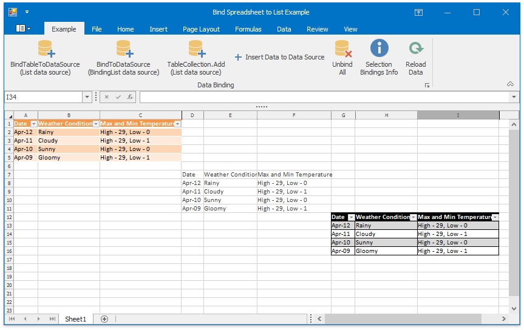

<!-- default badges list -->

<!-- default badges end -->

# How to: Bind a Worksheet to a Generic List or a BindingList Data Source

This example demonstrates the use of a [List\<T\>](https://learn.microsoft.com/en-us/dotnet/api/system.collections.generic.list-1?view=net-7.0) and [BindingList\<T\>](https://learn.microsoft.com/en-us/dotnet/api/system.componentmodel.bindinglist-1?view=net-7.0) objects as data sources to bind data to the worksheet range.

## Implementation Details

Use the [WorksheetDataBindingCollection.BindToDataSource](https://docs.devexpress.com/OfficeFileAPI/devexpress.spreadsheet.worksheetdatabindingcollection.bindtodatasource.overloads) method to bind data to the range, and the [WorksheetDataBindingCollection.BindTableToDataSource](https://docs.devexpress.com/OfficeFileAPI/devexpress.spreadsheet.worksheetdatabindingcollection.bindtabletodatasource.overloads) method to bind data to the worksheet table.

The [ExternalDataSourceOptions](https://docs.devexpress.com/OfficeFileAPI/DevExpress.Spreadsheet.ExternalDataSourceOptions) object specifies various data binding options. A custom converter with the [IBindingRangeValueConverter](https://docs.devexpress.com/OfficeFileAPI/DevExpress.Spreadsheet.IBindingRangeValueConverter) interface converts weather data between the data source and a worksheet.

If the data source does not allow modification, the binding worksheet range also prevents modification.

Data binding error results in the [WorksheetDataBinding.Error](https://docs.devexpress.com/OfficeFileAPI/DevExpress.Spreadsheet.WorksheetDataBindingCollection.Error) event and cancels data update. The event handler in this example displays a message containing the error type.

## Files to Review

* [Form1.cs](./CS/DataBindingToListExample/Form1.cs) (VB: [Form1.vb](./VB/DataBindingToListExample/Form1.vb))
* [MyConverter.cs](./CS/DataBindingToListExample/MyConverter.cs) (VB: [MyConverter.vb](./VB/DataBindingToListExample/MyConverter.vb))
* [WeatherReport.cs](./CS/DataBindingToListExample/WeatherReport.cs) (VB: [WeatherReport.vb](./VB/DataBindingToListExample/WeatherReport.vb))

## Documentation

* [Data Binding in WinForms Spreadsheet Control](https://docs.devexpress.com/WindowsForms/117679/controls-and-libraries/spreadsheet/data-binding)
